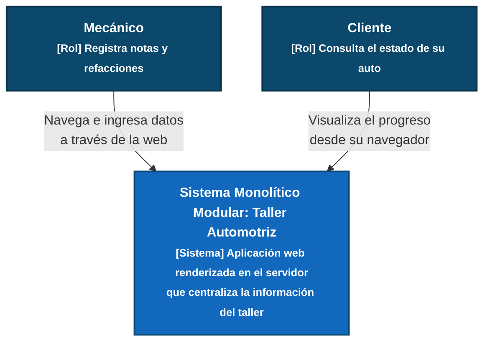

# ADR

| Campo  | Valor |
|--------|-------|
| Autor  | Patricio Medina Batún |
| Fecha  | 12/06/2026 |
| Estado | `Propuesto` |

---

## Contexto

El sistema a construir es un software de gestión para un Taller Automotriz, desarrollado como proyecto académico para la materia de Estructura de Software. 

El sistema debe soportar dos flujos operativos:
1. **Flujo del Mecánico:** Registra notas, estado de los vehículos y documenta las refacciones compradas.
2. **Flujo del Cliente:** Consulta de forma pasiva el avance y estatus actual de su automóvil.

**Restricción principal:** En esta iteración se requiere evitar la complejidad de serializar datos (No JSON / No APIs REST). El objetivo es priorizar el desarrollo de la lógica de negocio y el modelado correcto de las entidades, aunque se tiene la visión a futuro de desplegar la aplicación en la nube para que los clientes puedan acceder desde cualquier lugar.

---

## Decisión

Se ha decidido implementar un **Monolito Modular con el patrón MVC tradicional**, utilizando **Renderizado del lado del Servidor (Server-Side Rendering)**. 

### ¿Por qué?

1. **Evita la sobreingeniería (Sin JSON por ahora):** Al utilizar un framework MVC tradicional (como C# .NET o Java Spring), los Controladores procesan la lógica e inyectan los datos directamente en las Vistas (HTML). Esto elimina la necesidad de programar endpoints JSON y gestionar un proyecto frontend separado, permitiendo enfocar todo el esfuerzo en la estructura algorítmica y las reglas del taller.
2. **Modularidad para los roles:** Separar el código en módulos (`Usuarios`, `Vehículos`, `Órdenes`) permite que el `Controlador del Cliente` renderice una vista HTML limpia de solo lectura, mientras que el `Controlador del Mecánico` devuelve formularios completos, manteniendo la seguridad de los accesos sin requerir tokens complejos.

### Infraestructura (Despliegue y Visión a Futuro)

Por el momento, **el sistema correrá en `localhost`**. Sin embargo, esta decisión arquitectónica es 100% compatible con la nube. Un monolito MVC que renderiza HTML puede ser empaquetado y desplegado fácilmente en un servidor virtual (como AWS EC2 o Azure App Services) en el futuro. Esto garantizará que, sin cambiar una sola línea de la arquitectura actual, los clientes y mecánicos puedan acceder al sistema desde cualquier dispositivo con internet.

---

## Consecuencias positivas (Lo que gano)

- **Desarrollo centralizado e iteración rápida:** Al no tener que crear y documentar contratos JSON entre el backend y el frontend, el desarrollo es mucho más rápido y lineal. 
- **Preparado para la nube sin fricción:** El monolito contiene todo lo necesario para funcionar (lógica y vistas). Su migración futura a un entorno web público requerirá únicamente configurar el servidor de hosting, no reestructurar el código.

## Consecuencias negativas y Trade-offs (Lo que sacrifico o asumo)

- **Acoplamiento de la Interfaz (Trade-off técnico):** Al renderizar el HTML desde el servidor y no enviar JSON, sacrifico la posibilidad de conectar fácilmente una aplicación móvil nativa (iOS/Android) en el futuro. Si el taller requiere una app móvil nativa más adelante, tendré que refactorizar los controladores para exponer APIs.
- **Carga de procesamiento en el servidor (Trade-off de infraestructura):** El servidor no solo procesará la lógica de las refacciones, sino que también consumirá recursos ensamblando las páginas de la interfaz gráfica antes de enviarlas al cliente.


## Estrategia de Acceso a Datos en Producción

**Pregunta a resolver:** ¿Cómo va a acceder el sistema a sus datos cuando esté en producción? ¿Se usarán archivos JSON en EC2 o se migrará a una base de datos?

### Decisión
Para cuando subamos el proyecto a producción, decidí que lo mejor es **usar una Base de Datos Relacional (como PostgreSQL)** y cambiar por completo de andar guardando la información en archivos de texto JSON. 

Los datos se van a conectar directo a mis controladores a través de los modelos usando un ORM. Para no complicarme ni salirme del presupuesto en esta primera fase de la materia, voy a instalar la base de datos en la misma máquina virtual (como una instancia en AWS EC2) donde va a estar corriendo la página web.

### ¿Por qué?

**Para que no se rompan las relaciones (Integridad):** En el taller tenemos clientes, que tienen coches, que tienen órdenes de trabajo y usan refacciones. Todo está súper conectado. Si trato de manejar todas esas relaciones leyendo y escribiendo archivos JSON, se va a volver un desastre rápido y puedo dejar datos sueltos o huérfanos. Una base de datos relacional ya hace ese trabajo por mí y me asegura que la información cuadre.

## Declaración de Uso de IA

Para la elaboración de este documento y la generación visual de los diagramas, se utilizó asistencia de Inteligencia Artificial. Su uso se limitó de manera estricta a:
- Mejorar la redacción para plasmar con mayor claridad técnica las ideas.
- Generar la sintaxis correcta del código Mermaid para la representación de las vistas C4.


## Diagramas

### Diagrama C4 Nivel 1



### Diagrama C4 Nivel 2
```mermaid
flowchart TD
    classDef person fill:#0b486b,stroke:#08334c,color:white,font-weight:bold,stroke-width:2px;
    classDef layer fill:#1168bd,stroke:#0b4875,color:white,font-weight:bold,stroke-width:2px;
    classDef database fill:#228b22,stroke:#145214,color:white,font-weight:bold,stroke-width:2px;

    mecanico["Mecánico"]:::person
    cliente["Cliente"]:::person

    subgraph monolito ["Aplicación Web MVC (Monolito Modular sin APIs)"]
        style monolito fill:#f9f9f9,stroke:#999999,stroke-dasharray: 5 5
        
        subgraph capa_controladores ["Controladores Modulares (C)"]
            style capa_controladores fill:#ffffff,stroke:#bbbbbb
            ctrl_usuarios["Controlador de Usuarios"]
            ctrl_vehiculos["Controlador de Vehículos"]
            ctrl_ordenes["Controlador de Órdenes y Notas"]
        end

        subgraph capa_vistas ["Capa de Vistas Generadas en Servidor (V)"]
            style capa_vistas fill:#ffffff,stroke:#bbbbbb
            vista_mecanico["Interfaces de Gestión<br><font size=2>(Formularios de refacciones)</font>"]
            vista_cliente["Interfaces de Consulta<br><font size=2>(Lectura del estatus)</font>"]
        end

        subgraph capa_modelos ["Capa de Modelos de Datos (M)"]
            style capa_modelos fill:#ffffff,stroke:#bbbbbb
            modelos["Entidades Lógicas<br><font size=2>(Vehiculo, Nota, Refaccion)</font>"]
        end
    end

    database["Base de Datos Relacional<br><font size=2>[PostgreSQL / Instancia EC2]</font>"]:::database

    mecanico --> |"Petición HTTP"| ctrl_usuarios & ctrl_vehiculos & ctrl_ordenes
    cliente --> |"Petición HTTP"| ctrl_usuarios & ctrl_vehiculos & ctrl_ordenes

    ctrl_usuarios & ctrl_vehiculos & ctrl_ordenes --> |"Ejecuta lógica y consulta"| modelos
    modelos --> |"Lee/Escribe"| database
    
    ctrl_usuarios & ctrl_vehiculos & ctrl_ordenes -.-> |"Inyecta datos y renderiza<br>HTML (No JSON)"| vista_mecanico & vista_cliente
    ```