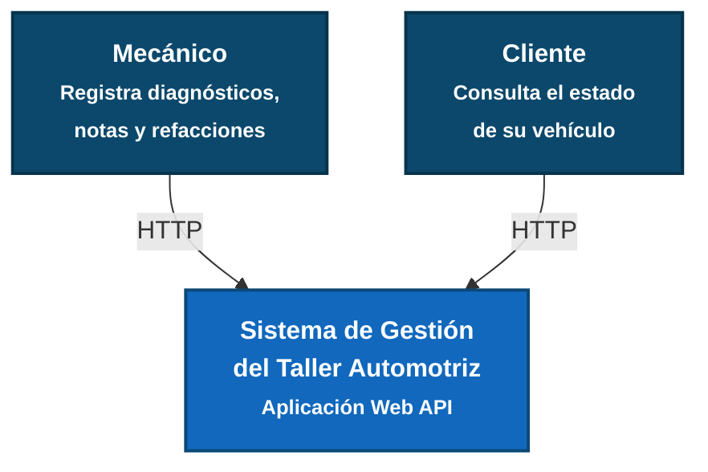
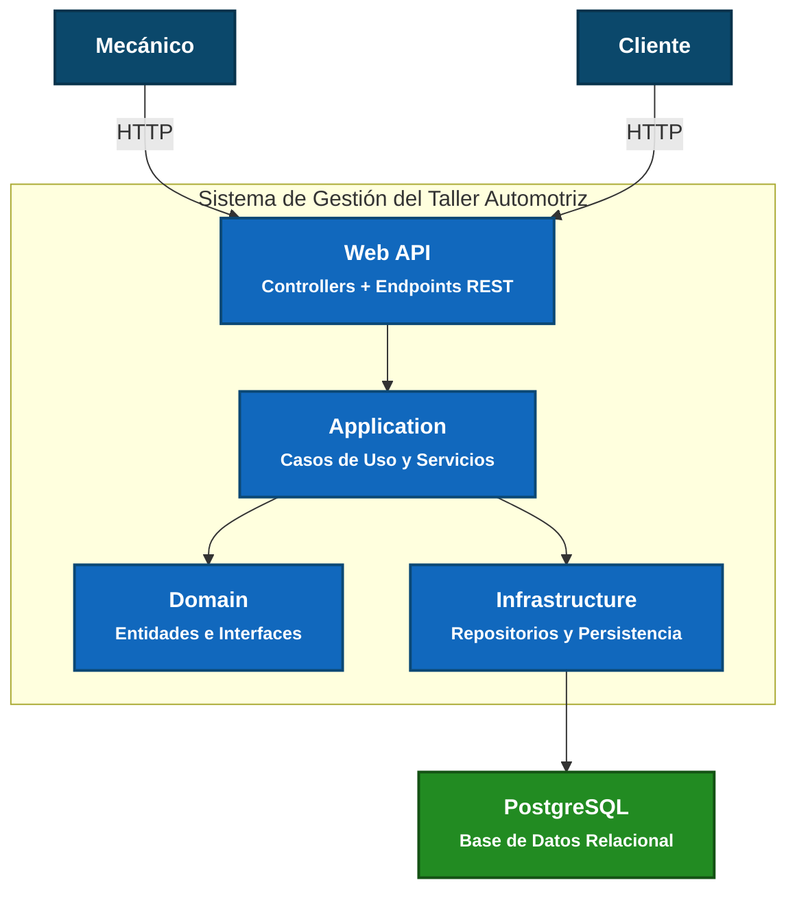
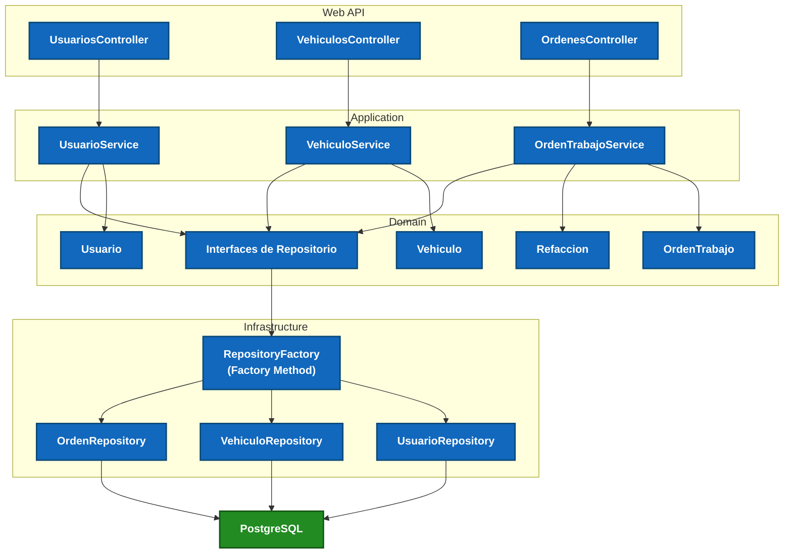

# ADR

| Campo  | Valor |
|--------|-------|
| Autor  | Patricio Medina Batún |
| Fecha  | 26/06/2026 |
| Estado | `Propuesto` |

---

# Contexto

El sistema a construir es un software de gestión para un **Taller Automotriz**, desarrollado como proyecto académico para la materia de **Estructura de Software**.

El sistema debe soportar dos flujos operativos:

1. **Flujo del Mecánico:** registra diagnósticos, notas de reparación, actualiza el estado del vehículo y documenta las refacciones utilizadas durante el servicio.
2. **Flujo del Cliente:** consulta de forma pasiva el avance y el estado actual de su automóvil.

Durante la primera etapa del proyecto se priorizó el desarrollo de la lógica de negocio utilizando una arquitectura sencilla y persistencia local. Sin embargo, para esta entrega integradora se requiere evolucionar la solución hacia una arquitectura por capas, preparada para una futura ejecución en la nube y documentando las principales decisiones arquitectónicas.

---

# Decisión 1. Estilo Arquitectónico

Se ha decidido implementar una arquitectura **Multicapa (Layered Architecture)** dividida en cuatro proyectos principales:

- **Domain**
- **Application**
- **Infrastructure**
- **Web API**

Cada capa tendrá una responsabilidad específica:

- **Domain:** contiene las entidades del negocio, interfaces y reglas del dominio. No depende de ninguna otra capa.
- **Application:** implementa los casos de uso del sistema y coordina la lógica de negocio.
- **Infrastructure:** implementa el acceso a datos y los repositorios necesarios para persistir la información.
- **Web API:** expone los endpoints REST y recibe las solicitudes HTTP de los clientes.

### ¿Por qué?

1. **Separación de responsabilidades:** Cada proyecto tiene una función claramente definida, facilitando el mantenimiento y la evolución del sistema.
2. **Bajo acoplamiento:** La lógica del negocio permanece independiente de la tecnología utilizada para almacenar los datos o exponer la aplicación.
3. **Escalabilidad:** En un futuro será posible cambiar la infraestructura o la base de datos sin modificar la lógica del dominio.

---

## Consecuencias positivas (Lo que gano)

- Código más organizado y fácil de mantener.
- Mayor reutilización de la lógica del negocio.
- Facilita realizar pruebas unitarias.
- Preparado para crecer sin modificar toda la aplicación.

## Consecuencias negativas y Trade-offs (Lo que sacrifico o asumo)

- Incrementa la cantidad de proyectos dentro de la solución.
- Requiere una configuración inicial más extensa.
- La comunicación entre capas agrega un poco más de complejidad respecto a un monolito tradicional.

---

# Decisión 2. Patrón GOF utilizado

Se decidió implementar el patrón **Factory Method** para la creación de los repositorios encargados del acceso a datos.

La creación del repositorio será delegada a una clase denominada `RepositoryFactory`, la cual decidirá automáticamente qué implementación utilizar dependiendo del entorno donde se esté ejecutando la aplicación.

Por ejemplo:

- **Development:** utilizar un repositorio local para facilitar el desarrollo.
- **Production:** utilizar un repositorio conectado a PostgreSQL.

### ¿Por qué?

1. **Evita modificar código al cambiar de entorno:** únicamente cambia la configuración del entorno.
2. **Cumple con el principio Open/Closed (OCP):** permite agregar nuevas implementaciones sin modificar la lógica del negocio.
3. **Reduce el acoplamiento:** el resto del sistema desconoce qué tipo de repositorio está utilizando.

---

### Decisión 2.1. Patrón Decorator para Observabilidad

Se ha implementado el patrón **Decorator** para envolver los repositorios existentes y añadir funcionalidades transversales como el registro de logs.

#### ¿Por qué?
1. **Separación de responsabilidades:** Permite agregar comportamiento (logging) sin modificar la clase original del repositorio.
2. **Observabilidad en la nube:** El `Console.WriteLine` del Decorator actúa como el puente perfecto para que herramientas como **AWS CloudWatch** capturen los eventos de ejecución (ej. "inicio", "consulta exitosa") sin acoplar la lógica de negocio con la infraestructura.
3. **Mantenibilidad:** Si los requisitos de log cambian en el futuro, solo modificamos el decorador, no la lógica de persistencia.

#### Consecuencias
- **Positivas:** Código más limpio (SRP), trazabilidad de operaciones en tiempo real y cumplimiento de estándares de observabilidad en AWS.
- **Trade-offs:** Introducción de una capa adicional de objetos que debe ser gestionada en la inyección de dependencias (`Program.cs`).

## Consecuencias positivas (Lo que gano)

- Cambio sencillo entre ambientes de desarrollo y producción.
- Menor acoplamiento entre la lógica del negocio y la persistencia.
- Mayor facilidad para futuras migraciones.

## Consecuencias negativas y Trade-offs (Lo que sacrifico o asumo)

- Se agrega una clase adicional para controlar la creación de objetos.
- La configuración inicial resulta ligeramente más compleja.

---

# Decisión 3. Estrategia de Acceso a Datos

Durante las primeras iteraciones se utilizaron archivos locales para almacenar la información.

Para el despliegue en producción se decidió migrar completamente a una **Base de Datos Relacional PostgreSQL**, accediendo a ella mediante un ORM desde la capa Infrastructure.

### ¿Por qué?

**Para mantener la integridad de la información.**

El sistema administra entidades altamente relacionadas:

- Clientes
- Vehículos
- Órdenes de servicio
- Refacciones
- Mecánicos

Una base de datos relacional garantiza que dichas relaciones permanezcan consistentes y evita problemas derivados del manejo manual de archivos.

---

## Consecuencias positivas (Lo que gano)

- Integridad referencial.
- Mejor rendimiento en consultas.
- Mayor seguridad de la información.
- Escalabilidad para futuras funcionalidades.

## Consecuencias negativas y Trade-offs (Lo que sacrifico o asumo)

- Requiere instalar y administrar un servidor de base de datos.
- Aumenta ligeramente la complejidad del despliegue.

---

# Decisión 4. Infraestructura

El sistema será desplegado en una **máquina virtual AWS EC2**.

Durante esta primera versión tanto la aplicación como PostgreSQL podrán ejecutarse dentro de la misma instancia para reducir costos y simplificar el despliegue.

En futuras versiones la base de datos podrá migrarse fácilmente hacia **Amazon RDS**, sin modificar la arquitectura del sistema.

### ¿Por qué?

Esta estrategia permite disponer de una aplicación accesible desde Internet sin incrementar innecesariamente la complejidad de la infraestructura durante la etapa académica.

---

## Consecuencias positivas (Lo que gano)

- Despliegue sencillo.
- Bajo costo de infraestructura.
- Fácil administración.

## Consecuencias negativas y Trade-offs (Lo que sacrifico o asumo)

- Aplicación y base de datos comparten los mismos recursos.
- No existe alta disponibilidad en esta primera versión.

---

# Decisión 5. Resiliencia del Sistema

Se decidió que las operaciones críticas del sistema (registrar órdenes, actualizar el estado de un vehículo o guardar notas del mecánico) deberán continuar funcionando incluso cuando falle algún servicio secundario.

En caso de que el servidor deje de responder:

- AWS Health Checks permitirán detectar la falla.
- Amazon CloudWatch registrará el incidente mediante logs y métricas.
- La instancia podrá reiniciarse o reemplazarse sin modificar la aplicación.

En una futura evolución del proyecto podrá incorporarse un **Elastic Load Balancer** junto con un **Auto Scaling Group** para automatizar la recuperación del servicio.

### ¿Por qué?

Aunque esta primera versión no implementará mecanismos avanzados de resiliencia, es importante documentar cómo responderá la arquitectura ante posibles fallos en producción.

---

## Consecuencias positivas (Lo que gano)

- Mayor disponibilidad del sistema.
- Mejor monitoreo del comportamiento de la aplicación.
- Recuperación más rápida ante fallos.

## Consecuencias negativas y Trade-offs (Lo que sacrifico o asumo)

- Requiere configurar servicios adicionales en AWS.
- Incrementa ligeramente el costo de infraestructura.

---

# Declaración de Uso de IA

Para la elaboración de este documento y la generación visual de los diagramas se utilizó asistencia de Inteligencia Artificial. Su uso se limitó de manera estricta a:

- Mejorar la redacción para plasmar con mayor claridad técnica las decisiones arquitectónicas.
- Generar la sintaxis correcta del código Mermaid para la representación de las vistas C4.
- Revisar la consistencia de las decisiones tomadas y sus respectivos trade-offs.

---

# Diagramas

### Diagrama C4 Nivel 1

### Diagrama C4 Nivel 2

### Diagrama C4 Nivel 3
